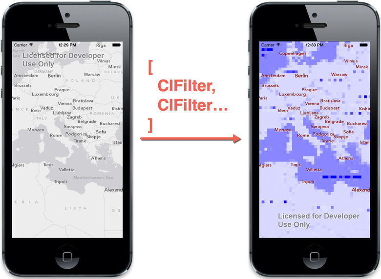

coreimage-tiled-layer-ios
=========================

This sample includes an example custom Tiled Layer based off core runtime AGSTiledLayer classes.

The example layer applies Core Image effects to tiles.



The above example applies a [blue color](https://developer.apple.com/library/ios/documentation/graphicsimaging/reference/CoreImageFilterReference/Reference/reference.html#//apple_ref/doc/filter/ci/CIColorMonochrome) filter and a [pixellation](https://developer.apple.com/library/ios/documentation/graphicsimaging/reference/CoreImageFilterReference/Reference/reference.html#//apple_ref/doc/filter/ci/CIPixellate) filter to the Grey Basemap Tiles and a [red color](https://developer.apple.com/library/ios/documentation/graphicsimaging/reference/CoreImageFilterReference/Reference/reference.html#//apple_ref/doc/filter/ci/CIColorMonochrome) filter to the Grey Reference Tiles.

## Getting Started

### Add the category to your project
1. Drag the `AGSCoreImageFilteredTiledMapServiceLayer.h` and `AGSCoreImageFilteredTiledMapServiceLayer.m` files into your ArcGIS Runtime for iOS project in Xcode.
2. Reference the layer class in your code (`#import` the `AGSCoreImageFilteredTiledMapServiceLayer.h` file).
3. In your code, create a TiledMapServiceLayer as usual. But rather than adding it to the map, pass it (along with a `CIFilter` or array of `CIFilter`s) to one of the class factory methods on `AGSCoreImageFilteredTiledMapServiceLayer`. Add the resulting `AGSCoreImageFilteredTiledMapServiceLayer` instance to the map.

For example:

```Objective-C
    CIFilter *blueFilter  = [CIFilter filterWithName:@"CIColorMonochrome" keysAndValues:@"inputColor", [CIColor colorWithRed:0 green:0 blue:1], nil];
    CIFilter *pixelFilter = [CIFilter filterWithName:@"CIPixellate" keysAndValues:@"inputScale", [NSNumber numberWithDouble:8], nil];
    AGSTiledMapServiceLayer *greyBasemap = [AGSTiledMapServiceLayer tiledMapServiceLayerWithURL:[NSURL URLWithString:kGreyURL]];

    AGSCoreImageFilteredTiledMapServiceLayer *bluePixelBasemap =
        [AGSCoreImageFilteredTiledMapServiceLayer tiledLayerWithTiledLayer:greyBasemap
                                                              imageFilters:@[blueFilter, pixelFilter]];

    [self.mapView addMapLayer:bluePixelBasemap];
```

## Notes
This code has been tested against the 10.2 release of the ArcGIS Runtime SDK for iOS. While it should work with the 10.1 release onwards and may work with earlier releases, it has not been tested against them.

At present, an `AGSRequest` instance is used to load the image data from the `requestTileForKey:` method. The ArcGIS Runtime will not invoke `requestTileForKey:` on the main thread, so this approach will not block the UI.

An ideal solution would make use of the `AGSImageDataRequestOperation` class so that operations can be cancelled, but this would involve creating and managing a Run Loop Thread.

## Requirements

* Xcode and the iOS SDK ([download](https://developer.apple.com/xcode/))
* ArcGIS Runtime SDK for iOS ([download](https://developers.arcgis.com/ios/?filename=AGSRuntimeSDKiOSv10.2-u1.pkg&folder=software/ArcGIS_RuntimeSDK/10.2))

## Resources

* [ArcGIS Runtime SDK for iOS](https://developers.arcgis.com/ios/)
* [ArcGIS Runtime SDK Forums](http://forums.arcgis.com/forums/78-ArcGIS-Runtime-SDK-for-iOS)
* [ArcGIS Blog](http://blogs.esri.com/esri/arcgis/)
* Twitter [@esri](http://twitter.com/esri)
* [Apple iOS Dev Center](https://developer.apple.com/devcenter/ios/index.action)

## Issues

Find a bug or want to request a new feature?  Please let us know by submitting an Issue.

## Contributing

Anyone and everyone is welcome to contribute. 

## Licensing
Copyright 2014 Esri

Licensed under the Apache License, Version 2.0 (the "License");
you may not use this file except in compliance with the License.
You may obtain a copy of the License at

   http://www.apache.org/licenses/LICENSE-2.0

Unless required by applicable law or agreed to in writing, software
distributed under the License is distributed on an "AS IS" BASIS,
WITHOUT WARRANTIES OR CONDITIONS OF ANY KIND, either express or implied.
See the License for the specific language governing permissions and
limitations under the License.

A copy of the license is available in the repository's [license.txt](license.txt) file.
[](Esri Tags: NorthArrow ArcGIS Mobile Mapping iOS iPhone iPad)
[](Esri Language: Objective-C)
